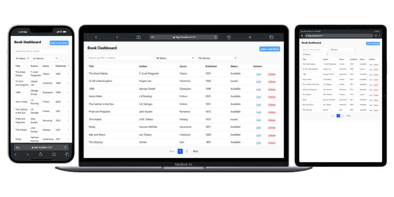

# 📚 Book Management Dashboard

A responsive and fully interactive React + TypeScript dashboard for managing a list of books with CRUD functionality, filters, search, pagination, modals, and toast notifications. Ideal for learning and demonstrating frontend engineering skills with real-world UI patterns and API integration.

## 🚀 Features

- 📋 List books in a responsive table/grid
- 🔍 Search by **title** or **author**
- 🎯 Filter by **genre** and **status**
- ➕ Add books using a modal form
- ✏️ Edit books with pre-filled forms
- 🗑️ Delete books with confirmation
- 🔄 Pagination (10 books per page)
- 🔔 Toast notifications for user feedback
- ⏳ Loading spinners and state handling
- ⚛️ React Query for performant data fetching and caching

## 🧱 Tech Stack

- ⚛️ [React](https://reactjs.org/) + [Vite](https://vitejs.dev/) + [TypeScript](https://www.typescriptlang.org/)
- 🎨 [Tailwind CSS](https://tailwindcss.com/)
- 📦 [React Hook Form](https://react-hook-form.com/) – form handling
- 🔄 [React Query](https://tanstack.com/query/latest) – API state management
- 🌐 [Axios](https://axios-http.com/) – HTTP client
- 🔔 [React Toastify](https://fkhadra.github.io/react-toastify/) – toast notifications
- 🧪 [json-server](https://github.com/typicode/json-server) – mock REST API

## 📁 Folder Structure

```
src/
├── api/              # Axios API handlers
├── components/       # UI components like modals
├── hooks/            # Custom React Query hook (useBooks)
├── pages/            # Page-level views (Dashboard)
├── types/            # TypeScript types and interfaces
├── App.tsx           # Root app component
├── main.tsx          # App entry point
└── index.css         # Tailwind CSS setup
```

## 🛠️ Setup Instructions

### 1. Clone the Repository

```bash
git clone https://github.com/iamsjunaid/book-management-dashboard.git
cd book-management-dashboard
```

### 2. Install Dependencies

```bash
npm install
```

### 3. 🧪 Setup Mock API with json-server

**Option A: Install Globally**

```bash
npm install -g json-server
```

**Option B: Install as a Dev Dependency**

```bash
npm install json-server --save-dev
```

Create a `db.json` file in your project root:

```json
{
  "books": [
    {
      "id": "1",
      "title": "The Great Gatsby",
      "author": "F. Scott Fitzgerald",
      "genre": "Classic",
      "publishedYear": 1925,
      "status": "Available"
    },
    {
      "id": "2",
      "title": "To Kill a Mockingbird",
      "author": "Harper Lee",
      "genre": "Historical",
      "publishedYear": 1960,
      "status": "Issued"
    }
  ]
}
```

Run the server:

```bash
json-server --watch db.json --port 3001
```

**🚨 Important**: To prevent Vite from reloading the app when `db.json` changes, add this to `vite.config.ts`:

```ts
server: {
  watch: {
    ignored: ['**/db.json'],
  },
},
```

### 4. ▶️ Start the App

```bash
npm run dev
```

- **Frontend**: http://localhost:5173
- **API**: http://localhost:3001/books

## 🔌 API Endpoints

- `GET /books` – List all books
- `POST /books` – Add a book
- `PUT /books/:id` – Update a book
- `DELETE /books/:id` – Delete a book

## 📸 Screenshots

<!-- Add your screenshots here -->

- 📋 Book listing with search and filters
- 🧾 Modal for adding/editing
- 🗑️ Delete with confirmation
- 🔔 Toasts for user feedback

## 🔧 Available Scripts

| Command           | Description                  |
| ----------------- | ---------------------------- |
| `npm run dev`     | Start the Vite dev server    |
| `npm run build`   | Build the app for production |
| `npm run preview` | Preview the production build |
| `json-server ...` | Start the mock API server    |

## 📄 License

MIT – free to use and modify.

## 🙌 Acknowledgements

This project was built as part of a React.js Developer Assessment Task.

## 💡 Future Improvements

- 🌍 Deploy to Vercel/Netlify
- ✅ Authentication (optional)
- 🧪 Unit tests and form validation tests
